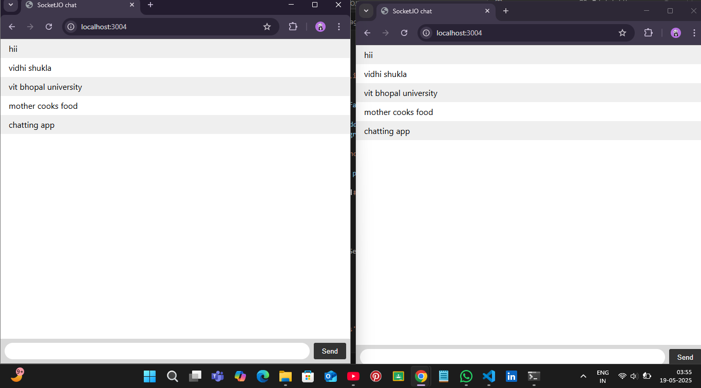

# WebSockets for Real-Time Communication (with Express.js)

A powerful demonstration of real-time bi-directional communication using WebSockets and Express.js. This application enables instant message transfer between a server and multiple clients, making it ideal for chat systems, collaborative tools, and live dashboards.

---

## ✨ Features

- Real-time communication using WebSockets
- Integrated with Express.js for HTTP handling
- Full-duplex (bi-directional) messaging
- Broadcast messages to all connected clients
- Handle multiple concurrent connections
- Graceful connection and disconnection handling
- Simple and minimal frontend to test real-time interaction

---

## 🖼️ Preview

> Replace the placeholder with a screenshot of your WebSocket app in action



---

## 📂 Project Structure

```
├── index.js               # Node.js + Express.js + WebSocket server
├── index.html             # Frontend HTML + JavaScript WebSocket client
├── package.json           # Project metadata and dependencies
├── package-lock.json      # Exact dependency versions
├── README.md              # Project documentation
└── assets/
    └── screenshot.png     # Preview image
```

---

## 🚀 Quick Start


### 1. Install dependencies

```bash
npm install
```

### 2. Start the Express + WebSocket server

```bash
node index.js
```

### 3. Open the client in a browser

Navigate to `http://localhost:3005` in your browser to interact with the app.

---

## 🔧 Configuration

You can change the server port by editing `index.js`:

```javascript
const PORT = process.env.PORT || 3005;
```

Or by setting the environment variable:

```bash
PORT=5000 node index.js
```

---

## 🏗️ How It Works

1. **Express.js** serves the static `index.html` file.
2. **WebSocket server** (via `ws` package) is attached to the same HTTP server.
3. **Client connects** to the WebSocket server via `ws://`.
4. **Messages** are broadcast to all connected clients.
5. **Disconnections** are handled gracefully and logged.

## 📫 Contact

Created with ❤️ by **VIDHI SHUKLA** 
